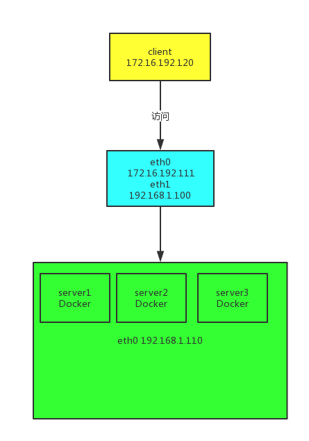

## 需求

通过树莓派做流量转发至后端服务器，通过 ip_forward 来进行流量转发，可以转发到不同网段。

可以在网络的前端防止 嗅探器，实质是一个流量转发的工具。

然后在同一个网段，将树莓派做成一个类似路由器的东西，但是不是路由器，开启 IP 转发，将所有包转发至后端的一台 Docker 集群。

但是这样的话， client 的 ip 就会丢失，我们并无法确定是谁访问了嗅探器。

在 后端服务器上面拿到的 ip 只是嗅探器的 ip。

> [Lvs](https://en.wikipedia.org/wiki/Linux_Virtual_Server) 是直接工作在内核的负载均衡器，调度能力很强。

## lvs 的调度方法

静态方法：仅根据算法本身进行调度

​	RR: round robin，轮调

​	WRR: weighted rr 加权论调

​	SH: source hash ,实现 session 保持的机制，将来自同一个 IP 的请求始终调度至同一 RS。

​	DH： destination hash。

对 SH 来讲，可以实现在反向代理为缓存做负载均衡，对 dh 来讲，可以实现在正向代理的时候对缓存做负载均衡。

动态方法（考虑是否是持久连接）： lc，wlc，，sed，nq，lblc，lblcr

​	overhead：active connections，inactive connections

LC： Least Connection

​	Overhead = Active * 256 + Inactive

WLC:  Weighted LC

​	Overhead = （Active * 256+Inactive）/ weight

SED： shortest Expection Delay（最短期望延迟）

​	Overhead = （Active+1）*256/weight

NQ： Never Queue

​	SED 算法的改进（第一轮各分一个，然后根据 SED 继续）

LBLC： Locality-Based LC，即为动态的 DH 算法

​	实现正向代理情形下的 cache server 调度

LBLCR：Locality-Based Least-Connection with Replication，带复制的 LBLC 算法。

## Lvs 模式

### 前言

* 一类是请求报文和响应报文都经由 Director 进行调度，理论最大连接三万多，在极高的负载场景中，Director 可能会成为性能瓶颈。
* 另一类是请求报文经由 Director ，响应报文一定不经由 Director，曾经有人做过测试，lvs 的并发可以达到百万级，是 HAproxy 难以望其项背的。

#### lvs-nat

多目标的 DNAT（iptables）：它通过修改请求报文的目标 IP 地址（同时可能会修改目标端口）

RS 应该和 DIP 使用私网地址，且 RS 的网关要指向 DIP 

请求和响应报文都要经由 Director 转发：极高负载的场景中， Director 可能会成为系统瓶颈

支持端口映射

RS 可以使用任意 OS

RS 的 RIP 和 Director 的 DIP 必须在同一 IP 网络。

#### lvs-dr

[lvs-dr 详解](https://blog.csdn.net/brad_chen/article/details/47807281)

它通过修改报文的目标 MAC 地址进行转发

保证前端路由器将目标 IP 为 VIP 的请求报文发送给 director；

解决方案：

​	静态绑定

​	arptables

​	修改 RS 主机内核的参数

RS 的 RIP 可以使用私有地址：但也可以使用公网地址

RS 跟 Director 必须在同一物理网络中

请求报文经由 Director 调度，但响应报文一定不能经由 Director

不支持端口映射

RS 可以是大多数 OS

RS 的网关不能指向 DIP

#### lvs-tun

不修改请求报文 IP 首部，而是通过在原有的 IP 首部，在封装一个 IP 首部。

RIP，DIP，VIP 全得是公网地址

RS 的网关不能指向 DIP

请求报文必须经由 Director 调度，但相应报文必须不能经由 Director

不支持端口映射

RS 的 OS 必须支持隧道功能

#### lvs-fullnat

​	（1）VIP 是公网地址： RIP 和 DIP 是私网地址，二者无需在同一网段中

​	（2）RS 接收到的请求报文的原地址为 DIP，因此要响应给 DIP

​	（3）请求报文和响应报文都必须经由 Director

​	（4）支持端口映射

​	（5）RS 可以使用任意 OS

