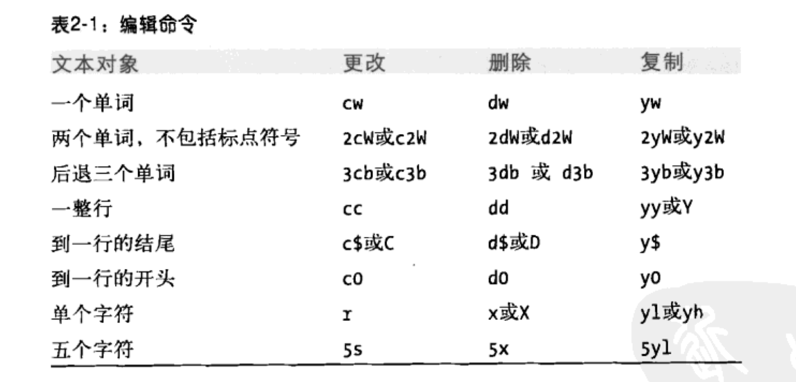

##  命令

`:e! 回车`

恢复上一次存储文件的内容，这样你可以从头再来。

`:q! 回车`

直接退出，不保存修改的操作。

` :w newfile` 将编辑的结果写入新文件

想写入文件，却没有写入的权限，并得到 ”Permission denied“ 消息的时候使用。

 ## 移动

可以在移动命令前面加上数字，如 `4l`  命令光标向右移动4个字符， `4w` 光标向右移动4个单词的位置等等。

可以通过  `:set wm=10` 来设置自动换行字符最大为10个字符。

`w` 小写的’w‘ 不忽略标点进行向右单词移动

`W` 大写的 ’W‘ 忽略标点进行单词向右移动

b 和 B 同理 w 和 W ，相反。

使用 `c2b` 表示 向前移动两个单词更改

`cc` 整行进行替换或者`C`。 为什么不用 `dd` 呢，那么就需要多一步的操作，需要先`dd` ，然后在插入` o`

`r` 更换字符

`~` 将字符换成大写

`u` 撤销回到上一次操作。`U` 撤销本行的所有操作。

## 文本操作

可以使用 `p` 命令，恢复最近几次的删除动作，因为 vi 会将最近 9 此的删除动作保存在 9 个编号的缓冲区中。如果要恢复第 2 个缓冲区，可以输入 `2p`

重复上一个操作使用 `.`

使用 `J` 合并行 ，使用 `3J` 可以合并三行

## 滚动屏幕

Control + F ： 向前滚动一整屏

Control + D：向前滚动半屏

Control + B ：向后滚动一整屏

Control + U：向后滚动半屏

Control + Y：向下滚动一行，光标不移动

Control + E：向上滚动一行，光标不移动

### 根据行移动

ENTER ：移动下一行的第一个字符。

`+` ：移动到下一行的第一个字符。

`-` ：移动到一行的第一个字符。

`n|` 移动到当前行的 n 列