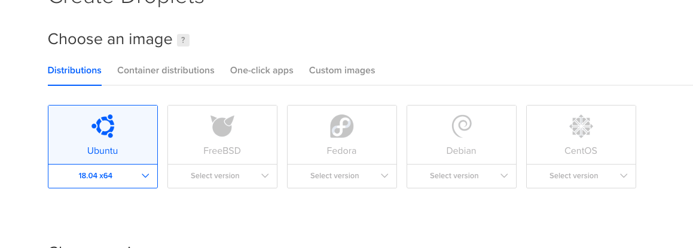
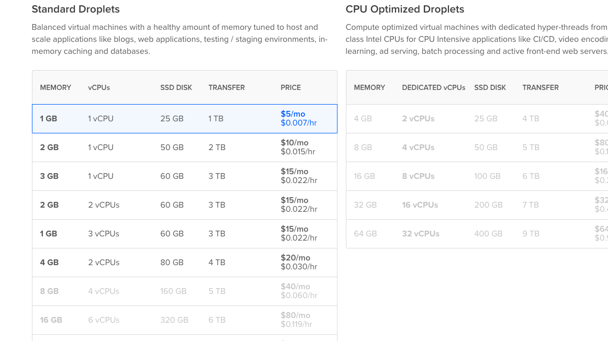
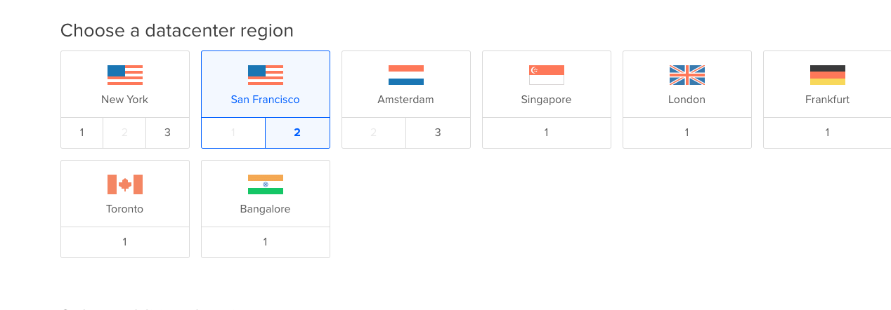
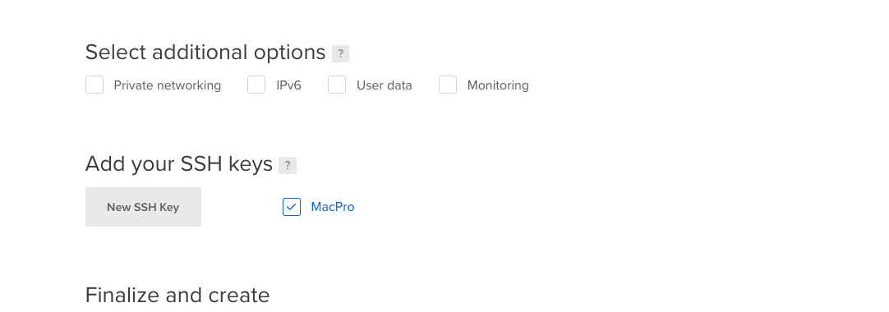
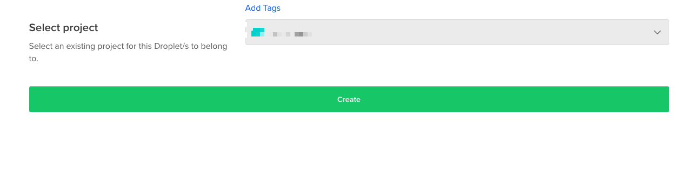
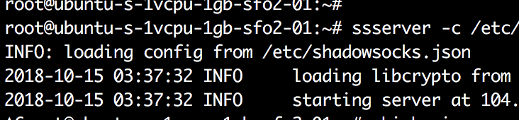

github 上面有一个项目，为了方便学生创业或者做一些开发的优惠活动，只要是在校学生就可以申请。

[github education](https://education.github.com/pack) 详细内容

近日，在国内访问google非常受限，有的时候收一个google邮箱，需要费很长时间，一些ss服务商经常跑路，这就让我的时间造成了严重的浪费，在紧要关头需要收发邮件的时候，却连不上服务器，在代码出现bug，baidu无能为力的时候，google又挂了。实在很不舒服。

想买一个国外服务器，又一看价格，太贵了，还是乖乖用我那不稳定的ss服务吧。 但是心里始终不想屈服，就想到了github education package 里的优惠，让我最看重的就是里面的DigitalOcean给的优惠卷，算了一下可以总共获得60刀 , 然后可以买个vps，买最低配置的 5刀 每月，算一算可以用上一年了，自己搭的再也不怕被封了，而且又稳定，还可以干一些别的事情呢。。

<!-- more -->

先说一下我的申请流程：
直接上网站一路点下去，get pack ,然后它会让你填一些信息来验证你是学生。

因为我的学校没有给学生开放 @edu 邮箱的服务，所以，只能上传能证明我是学生的证件来申请，我使用的是学生证，那张带照片的那一页拍照上传，
如果有邮箱，就可以直接填写邮箱来验证了。

接下来，我们要填一些内容，其中有一项是要描述我们用那些工具做什么，开始我还觉得说我要搭建vpn，这么一点小事情，估计会不给通过，但是，我还是诚实的写了我要做什么，不要说什么大话，你要为github干什么干什么，你想干嘛就写什么，真实就好，还有就是用英文来写，不要用中文，我以前用中文写，都被拒绝了，而且也不要用翻译软件。

下面是我写的原文，英文不好，但还是保持最大的真诚来写的：

first of all ,please excuse me ,my english is not good. ok, i want to get discount ,in my country,i can not get google, ranther than , in IT ,we ususl meet some tourble , i have to google it , i had bought shdowsockts ,but it very unstable ,maybe when i open my macbook, it diswork. so it waste me many time, i want to use vps for vpn, and i want to use github for my codes , on my graduation , i could get a good work , thaks.
my shool is not students's email.

当我再看一遍的时候，我发现了我有的词都写错了。shool  哈哈， 不过还是被我的真诚打动了，看懂了我要做什么，就是这么直接，说明你想干嘛就好了。

然后填写一些必要的信息就可以提交了，一般24hour内就可以收到回复，他会发一封邮件到你的邮箱，告诉你是否成功，我是下午申请的，在晚上1点多的时候就收到了邮件告诉我成功了，当时的心情还真是十分愉快的。


然后就可以点击链接去看我们的产品了。

* 先说 DigitalOcean 

注册过DigitalOecan过的用户会给一个推荐注册地址，你们从这个地址注册DigitalOcean 会获得10刀
第一步[注册链接地址](https://m.do.co/c/cdd31cc97a15) 注册 获得10刀
账户需要先激活，激活的过程中会让你用信用卡，或者paypal支付，先支付5刀进行激活账户，没有pal账户的可以先到paypal官网注册一个账户，[paypal官网](https://www.paypal.com/c2/home) 。注册的时候填好信息就行了，我注册的时候遇到一个问题，不知道cvs是什么，其实是信用卡背面的一个后三位数字，填上去就行了，我没有试过借记卡，有人说也可以，大家自己填好就行。

然后我们在DigitalOcean 支付的时候使用paypal进行支付就行，我开始使用建设银行的信用卡，但是一直不行，我就用的paypal。大家可以自己选择。

支付完成后你的账户就激活了，并且里面有15刀。

下面我们开始获取github给的50刀

点击github那个连接找到DigitalOcean 处的链接，直接用你刚才注册的账号登录DigitalOcean，然后点击网页右上角的下方一点的头像，有个setting点进去，然后在左侧找到billing，然后下拉有一个标题是promo code，
复制github中DigitalOcean那里给的code，点击apply，如果成功的话，那就恭喜你已经有了65刀，如果没有成功，说无法使用，也没关系，如果这个账号是你以前注册过的， 我们就直接去Ticket就行了，基本是几分钟之内就到账了。

如何Ticket？
我们点击support，然后下拉找到 contact support点进去，然后写内容就行，还是用英语写，下面是我写的：
标题：
i can't use github promo code

正文：
Hello, I have signed before pass my Github Student Developer Pack, 
and now I passed my Github Student Developer Pack, but can not activate my code. My code is: *#FCK#jd^@GITHUB-b16a6870 Please help me activate this code. Thank you.

把自己的code写在里面，然后提交等待就好了。

这样我们就完没的获得了65刀。接下来，就能买自己需要的产品了，我就不再叙述了，看个人需求。
我买的是5刀一个月的服务器，来搭建一些东西，完全够用了。

下面贴出一个如何有效利用github给的东西，不能浪费。

[知乎上的链接](https://www.zhihu.com/question/25868778)


## 使用 DigitalOcean 自己搭建 翻墙

首先登入 DigitalOcean 官网：[官网](https://cloud.digitalocean.com)


选择 Create ——> Droplets



选择一个系统



5$ 就够



选择一个地理节点



可以添加一个公钥，这样创建完成就可以直接 ssh 连接上去。不知道 ssh keys 是什么的，[可以看这里](https://www.jianshu.com/p/31cbbbc5f9fa)

如果实在不会，后面用密码也可以登录的。

然后就点击：Create



我是使用 ssh keys 进行配置的，然后在本机做一下配置之后，就可以直接连进去了。

连进去之后，我的这个版本没有python，那么就先：

`apt install python`

如果找不到的话，先 `apt update && apt upgrade `

然后在执行

`apt install python`

`apt install python-pip`

`pip install shadowsocks`

然后使用创建配置文件，加密方式、端口、密码可以自行更改：

`vim /etc/shadowsocks.json`

```shell
{
 "server":"你的服务器ip地址",
 "server_port":8388,
 "local_address": "127.0.0.1",
 "local_port":1080,
 "password":"你设置的密码",
 "timeout":300,
 "method":"aes-256-cfb",
 "fast_open": false
}
```

然后：

```shell
ssserver -c /etc/shadowsocks.json

#或者在后台运行
ssserver -c /etc/shadowsocks.json -d start
ssserver -c /etc/shadowsocks.json -d stop
```

发现报错：


查了下资料，发现 ubuntu 18.04 默认的 openssl 升级到了 1.1.0 版本

> 这个问题是由于在openssl1.1.0版本中，废弃了EVP_CIPHER_CTX_cleanup函数，如官网中所说：
>
> **EVP_CIPHER_CTX was made opaque in OpenSSL 1.1.0. As a result, EVP_CIPHER_CTX_reset() appeared and EVP_CIPHER_CTX_cleanup() disappeared. 
> EVP_CIPHER_CTX_init() remains as an alias for EVP_CIPHER_CTX_reset().**

修改方法：

1. 用vim打开文件：vim /usr/local/lib/python2.7/dist-packages/shadowsocks/crypto/openssl.py (该路径请根据自己的系统情况自行修改，如果不知道该文件在哪里的话，可以使用find命令查找文件位置)
2. 输入`/cleanup` 回车 进行搜索然后把cleanup全部替换为 reset 即可。
3. 保存并退出

或者使用 sed 一行命令解决

`sed -i  "s/\(.*\)cleanup\(.*\)/\1reset\2/g" /usr/local/lib/python2.7/dist-packages/shadowsocks/crypto/openssl.py`

（如果目录位置不一样，记得更换文件位置。）

然后再次启动：

就好了，现在就就可以配置 客户端进行连接了。

[Mac 版本](https://github.com/shadowsocks/ShadowsocksX-NG/releases/)

[WIndows 版本](https://github.com/shadowsocks/shadowsocks-windows/releases)

