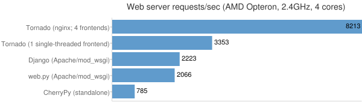

## Tornado 对比 Django

Django 的 web 应用部署时采用 wsgi 协议与服务器对接，而这类服务器通常都是基于**多线程**的，也就是说每一个网络请求都会有一个对应的线程来进行处理。

Django是走**大而全**的方向，注重的是**高效开发**，它最出名的是其全自动化的管理后台：只需要使用起ORM，做简单的对象定义，它就能自动生成数据库结构、以及全功能的管理后台。

Django提供的方便，也意味着Django内置的ORM跟框架内的其他模块耦合程度高，应用程序必须使用Django内置的ORM，否则就不能享受到框架内提供的种种基于其ORM的便利。

- session功能

- 后台管理

- ORM

Tornado走的是**少而精**的方向，注重的是**性能优越**，它最出名的是异步非阻塞的设计方式。

- HTTP服务器
- 异步编程
- WebSockets

Tornado应该运行在**类Unix平台**，在线上部署时为了最佳的性能和扩展性，仅推荐**Linux**和**BSD**（因为充分利用Linux的epoll工具和BSD的kqueue工具，是Tornado不依靠多进程/多线程而达到高性能的原因）。

对于Mac OS X，虽然也是衍生自BSD并且支持kqueue，但是其网络性能通常不太给力，因此仅推荐用于开发。

对于Windows，Tornado官方没有提供配置支持，但是也可以运行起来，不过仅推荐在开发中使用。

## 在大量的HTTP持久连接存在的情况下

用户量大，高并发

​	如抢购、春节抢火车票、双十一淘宝等等

使用同一个 TCP 连接来发送和接受多个 HTTP 请求/应答，而不是为每一个新的请求/应答打开新的连接。

​	对于 HTTP 1.0 ，可以在请求的包头 （Header） 中添加 Connection： Keep-Alive

​	对于 HTTP 1.1，所有的连接默认都是持久连接。

对于这两种场景，多线程的服务器很难应付

## C10K问题

对于前文提出的这种高并发问题，我们通常用C10K这一概念来描述。C10K—— **C**oncurrently handling **ten thousand** connections，即并发10000个连接。对于单台服务器而言，根本无法承担，而采用多台服务器分布式又意味着高昂的成本。如何解决C10K问题？

## Tornado 的一些特点

作为 Web 框架，是一个轻量级的 Web 框架，类似于另一个 Python web 框架 Web.py，其拥有异步非阻塞 IO 的处理方式。

作为 Web 服务器，Tornado 有较为出色的抗负载能力，官方用nginx反向代理的方式部署Tornado和其它Python web应用框架进行对比，结果最大浏览量超过第二名近40%。

性能： Tornado有着优异的性能。它试图解决C10k问题，即处理大于或等于一万的并发，下表是和一些其他Web框架与服务器的对比:

tornado 分为框架 和 服务器，推荐一起使用它的框架和服务器，否则就无法很好的发挥异步非阻塞的优势。